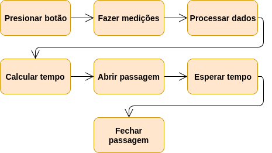
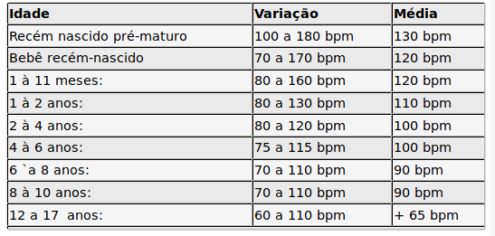

Semáforo com batimentos cardíacos, Arduino.
===========================================

## O que é o Arduino?
"Arduino é uma plataforma de prototipagem eletrônica de hardware livre e de 
placa única, projetada com um microcontrolador **Atmel AVR** com suporte de 
entrada/saída embutido, uma linguagem de programação padrão, a qual tem origem
em **Wiring**, e é essencialmente **C/C++**. O objetivo do projeto é criar 
ferramentas que são acessíveis, com baixo custo, flexíveis e fáceis de se usar 
por principiantes e profissionais. Principalmente para aqueles que não teriam
alcance aos controladores mais sofisticados e ferramentas mais complicadas." 
-- [Wikipedia](https://pt.wikipedia.org/wiki/Arduino)

O experimento
=============
## Descrição
O experimento consiste em fazer medições dos seus batimentos cardíacos, então 
com uma média obtida através das mesmas, é regulado o tempo de passagem do 
pedestre.

O Arduino se encarrega de tudo: da obtenção dos resultados, dos processamentos 
dos dados, do controle das luzes do tráfico e das luzes da passagem de 
pedestres. Tudo isto é executado sem nenhum problema por esta plataforma, e sem 
a necessidade de sistemas embarcados adicionais para o controle de componentes.

## Funcionamento

## Dados usados

## Dados assumidos para o experimento
- Número de batimentos por minuto normal: **60 ~ 144**
- Número de batimentos por minuto médio: **145**
- Número de batimentos por minuto alto: **175**
- Número de batimentos por minuto máximo: **185**

*Obs: O número de batimentos podem variar muito de pessoa à pessoa, então foram
assumidos alguns dos valores como base.  
Por exemplo, o número de batimentos por 
minuto de um atleta pode ser tão baixo quanto 40.*

## Materiais usados
- 5x **Resitor 1kΩ**
- 1x **Resistor 10kΩ**
- 2x **Led vermelho**
- 2x **Led verde**
- 1x **Led amarelo**
- 1x **Botão**
- 1x **Arduino Uno**
- 1x **KY-039** (Sensor)
- 1x **Breadboard**
- 1x **Buzzer**
- Alguns **Jumpers**